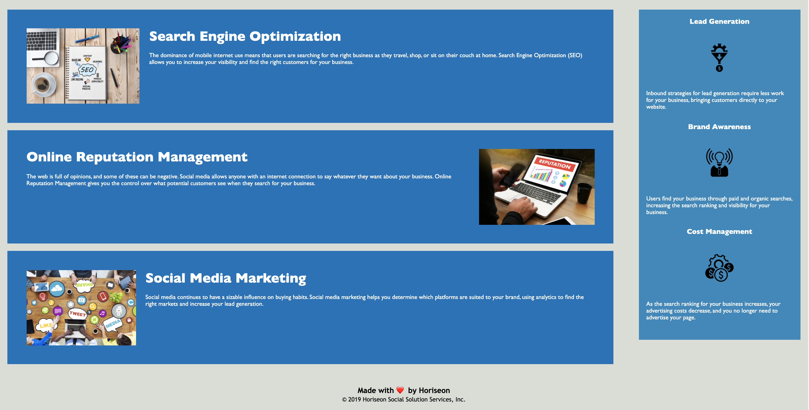

   # heri-sos

### images :camera_flash:

### goals :page_with_curl:
* webpage meets accessibility standards with alt attributes present in the image elements
* HTML has semantic elements and follows a logical structutre
* heading attributes fall in sequantial order
* title is consise and descriptive

### design progress :wrench: 
  
* title changed to be desctiptive
* code refactored with alt tags to all images to meet accessibility standards
* added all the semantic HTML elements needed

### technology :label: 
* HTML5
* CSS

### web access  :repeat_one:
Click here for the access  to [HERI-SOS](https://marynapr.github.io/Heri-sos//) 

### questions :question: 

Feel free to contact me with any questions via email :e-mail: pryadkamaryna@gmail.com. 
  
If you'd like to see my other projects, please visit my :octocat: 
[GitHub](https://github.com/MarynaPR?tab=repositories)